# Prueba Tecnica Todo List PHP

# Tabla de contenido

- [Estructura del Proyecto](#estructura-del-proyecto)
- [Ejecutar el Proyecto en Local](#ejecutar-el-proyecto-en-local)
- [Configuración de la Base de Datos MySQL](#configuración-de-la-base-de-datos-mysql)
- [Comprobamos la Conexión Interactuando con el Proyecto](#comprobamos-la-conexión-interactuando-con-el-proyecto)
- [TODO](#todo)

# Estructura del Proyecto

Este proyecto sigue una estructura organizada en diferentes directorios para facilitar la gestión de archivos y mantener un código limpio y mantenible. A continuación se presenta la estructura de carpetas y archivos:

## assets
Contiene los archivos de estilos y otros recursos estáticos.

- **icons/**: Carpeta para almacenar iconos utilizados en el proyecto.
- **dialog.js**: Archivo JavaScript para manejar los diálogos de la interfaz.
- **status_style.css**: Hoja de estilo CSS para los estados de las tareas.
- **style.css**: Hoja de estilo principal para la interfaz del proyecto.

## config
Contiene la configuración general del proyecto.

- **config.php**: Archivo PHP con la configuración de la base de datos y otros parámetros de configuración.

## public
Contiene los archivos accesibles públicamente y las funcionalidades principales del proyecto.

- **create_task.php**: Script para crear una nueva tarea.
- **delete_task.php**: Script para eliminar una tarea existente.
- **edit_task.php**: Script para editar los detalles de una tarea.
- **login.php**: Script de inicio de sesión de usuario.
- **logout.php**: Script para cerrar la sesión de usuario.
- **register.php**: Script para registrar un nuevo usuario.
- **tasks.php**: Página principal que muestra las tareas del usuario.

## sql
Contiene los scripts de base de datos necesarios para configurar el proyecto.

- **setup.sql**: Script SQL para crear las tablas necesarias en la base de datos.

## src
Contiene los archivos fuente de las clases y funciones del proyecto.

- **Database.php**: Clase para la conexión y operaciones con la base de datos.
- **Task.php**: Clase para gestionar las tareas (crear, editar, eliminar).
- **User.php**: Clase para gestionar las operaciones de usuario (registro, inicio de sesión).

## .htaccess
Archivo de configuración de Apache para manejar redirecciones y configuraciones de servidor.

#

# Ejecutar el Proyecto en Local

### 1. Instalar XAMPP / LAMPP

Descarga e instala la última versión de XAMPP desde [Apache Friends](https://www.apachefriends.org/es/download.html). Se recomienda la versión **8.2.12**.

### 2. Descargar el Proyecto

Clona o descarga el repositorio del proyecto desde [GitHub](https://github.com/loganscodes/prueba-php). Esto descargara una carpeta llamada **prueba-php** que contiene todo el código necesario para la prueba técnica.

### 3. Configurar el Proyecto en XAMPP

1. **Iniciar XAMPP**: Una vez instalado XAMPP, abre la aplicación y mueve la carpeta **prueba-php** al directorio **htdocs**. Para facilitar este paso, puedes hacer clic en el botón **Open Application Folder** en el panel de control de XAMPP, lo cual te llevará directamente a la carpeta **htdocs**.

    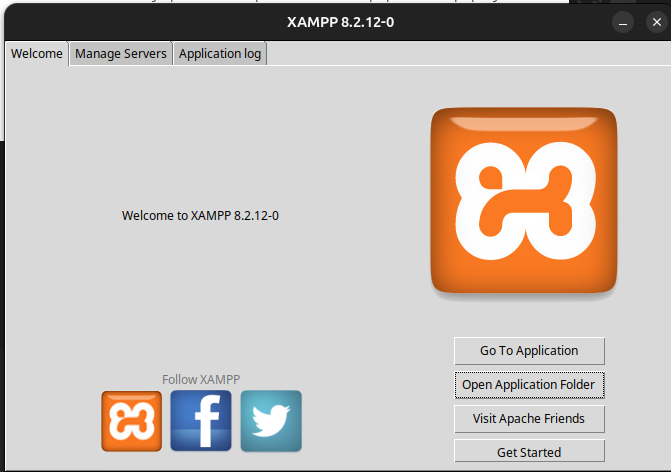

2. **Mover la Carpeta**: Accede a la carpeta **htdocs** y coloca la carpeta **prueba-php** dentro de ella.

    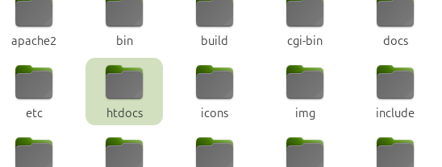

3. **Iniciar los Servicios de XAMPP**: Cambia a la pestaña **Manage Servers** en el panel de control de XAMPP e inicia los servicios requeridos (Apache y MySQL) como se muestra en la captura de pantalla.

    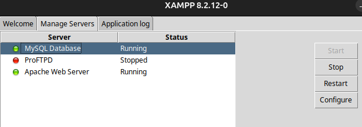

### 4. Verificar la Instalación

Para asegurarte de que todo está funcionando correctamente, escribe `localhost` en tu navegador. Deberías ver la página de inicio de XAMPP como se muestra en la siguiente imagen. Si es así, la configuración se ha realizado correctamente. Si encuentras algún error, verifica que los servicios necesarios estén en ejecución.

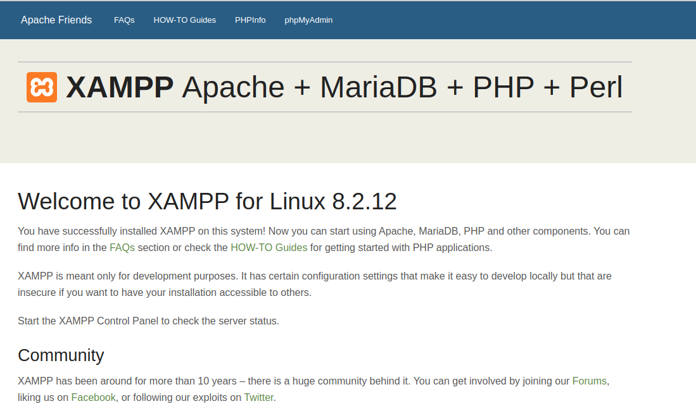

### 5. Acceder al Proyecto

Para acceder al proyecto una vez que la carpeta **prueba-php** esté dentro de **htdocs**, escribe `localhost/prueba-php/` en la barra de direcciones de tu navegador. Esto te llevará directamente a la página de inicio de sesión, gracias a la configuración en el archivo `.htaccess`.

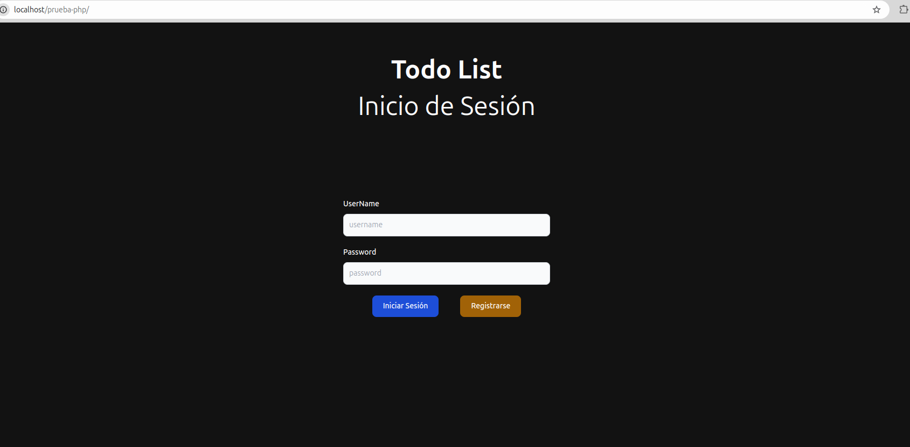

# Configuración de la Base de Datos MySQL

Para crear la base de datos, abre tu navegador y escribe `localhost/phpmyadmin/`. Esto te llevará al gestor de bases de datos incluido en XAMPP, llamado **phpMyAdmin**.

En el proyecto se incluye el código necesario para la creación de la base de datos, que se encuentra en el archivo **prueba-php/sql/setup.sql**. Accede a esta ubicación y copia el contenido del archivo.

### Pasos para crear la base de datos:

1. En phpMyAdmin, haz clic en **Nueva** para crear una nueva base de datos. Luego, cambia a la pestaña **SQL** y pega el código que copiaste del archivo `setup.sql`.

    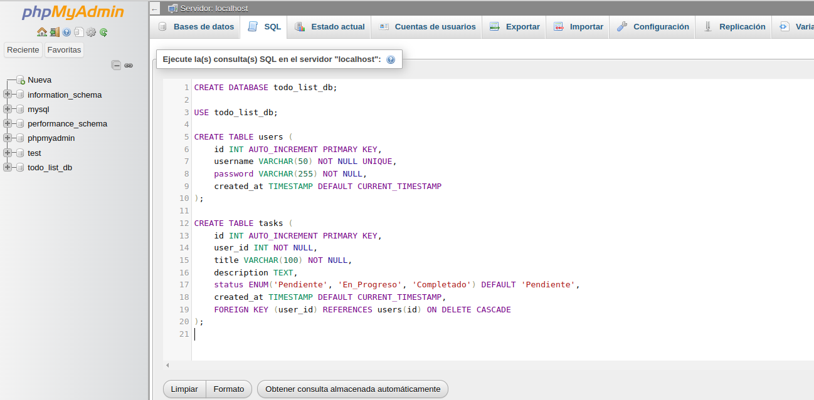

2. Haz clic en el botón **Continuar**. Esto creará la base de datos con todos los campos necesarios para el funcionamiento del proyecto. Con la base de datos creada, podrás registrar usuarios, iniciar sesión, y agregar, editar o eliminar tareas.

    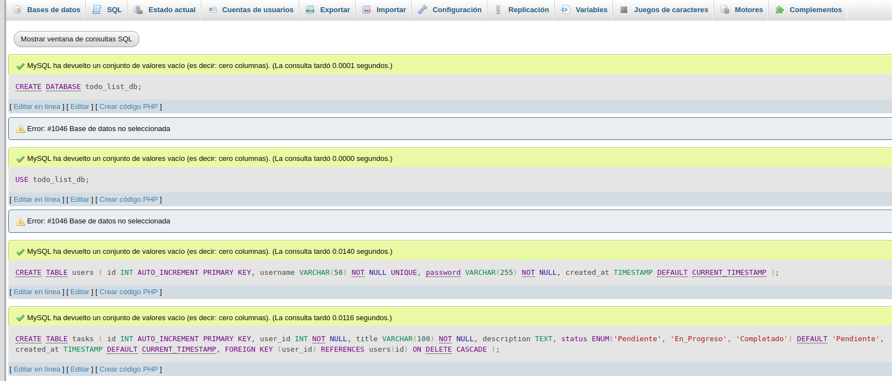

### Conectar el proyecto con la base de datos.

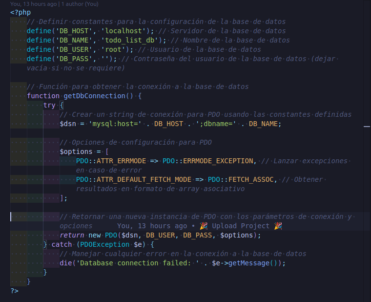

Para conectar el proyecto con la base de datos se tiene que ir a la carpeta **config/config.php** e ingresar las credeciales, en una instalacion limpia de XAMPP los valores por defecto son estos:

* define('DB_HOST', 'localhost'); 
* define('DB_NAME', 'todo_list_db');
* define('DB_USER', 'root');
* define('DB_PASS', ''); 

Y con eso sera la configuracion para correr el proyecto en local. 

# Comprobamos la Conexión Interactuando con el Proyecto

Para verificar que la conexión con la base de datos es correcta, realizamos las siguientes acciones dentro del proyecto:

1. Navega a la ruta `login.php` y haz clic en el botón **Registrarse**. Llena los campos solicitados para crear un nuevo usuario.

    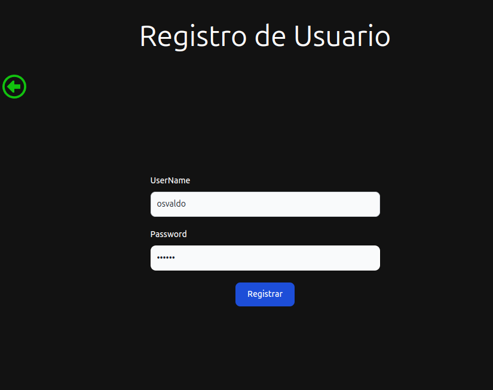

2. Consulta la tabla `users` en la base de datos para confirmar que el registro se ha realizado correctamente. Nota que las contraseñas están encriptadas para mayor seguridad.

    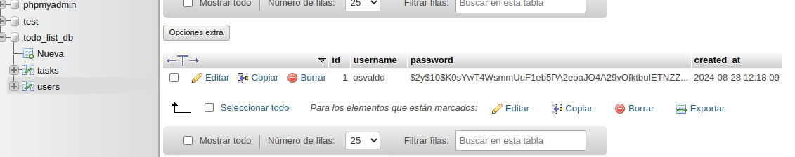

3. Inicia sesión con los datos previamente registrados. Serás dirigido a la página principal, donde podrás crear, editar y eliminar tareas.

### Crear una Tarea

- Llena los campos solicitados y haz clic en el botón **Crear Tarea**.

    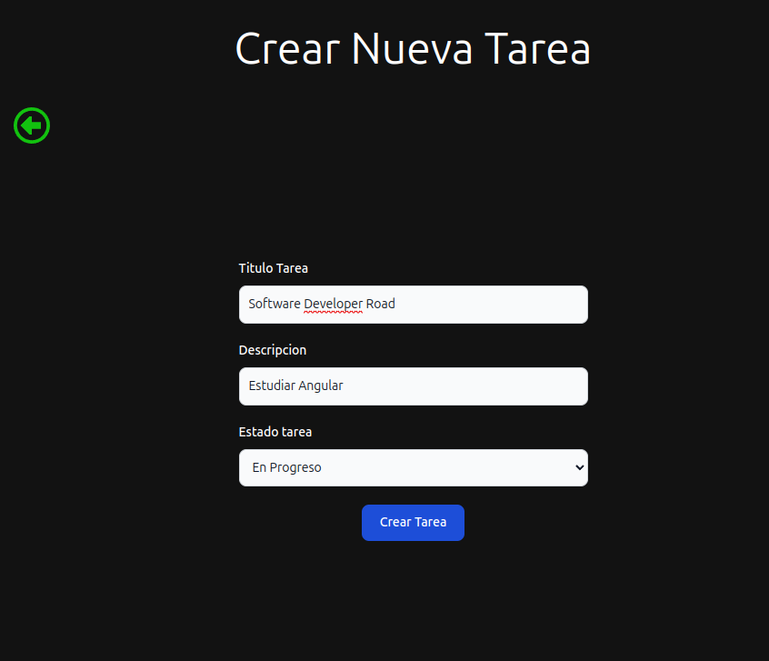

- La tarea se creará con su estado inicial configurado en "En progreso", según la selección realizada durante la creación.

    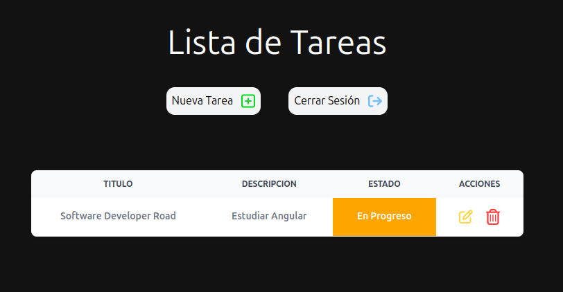

### Editar una Tarea

- Haz clic en **Editar Tarea** para cambiar el estado o el nombre de la tarea. En este ejemplo, cambiaremos el estado a "Completado". Se han agregado clases CSS para cambiar el color de la celda dependiendo del estado seleccionado.

    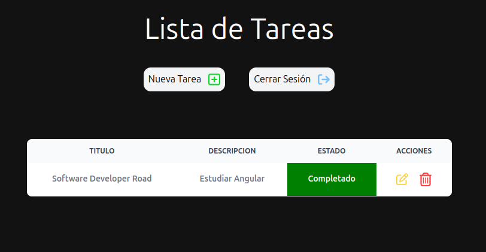

### Eliminar una Tarea

- Puedes eliminar una tarea que ya no sea necesaria. Se mostrará un cuadro de diálogo para confirmar la eliminación. Haz clic en **Aceptar** para eliminar o en **Cancelar** para conservar la tarea.

    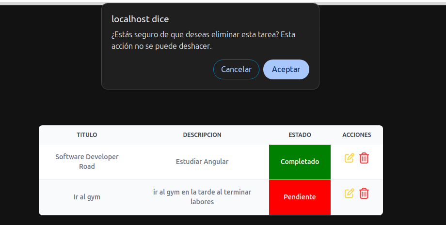

### Guardar en la Base de Datos

- Gracias a la conexión con la base de datos, todos los registros de tareas se guardan en la tabla `tasks`, lo que permite gestionar las tareas de manera persistente.

    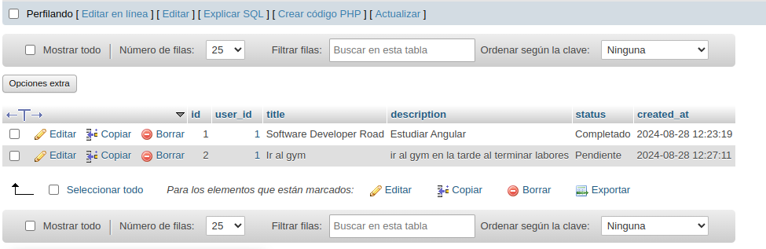

# TODO

### Comentarios en el Código

Cada clase del proyecto está comentada para facilitar la comprensión y explicar la utilización del código.

